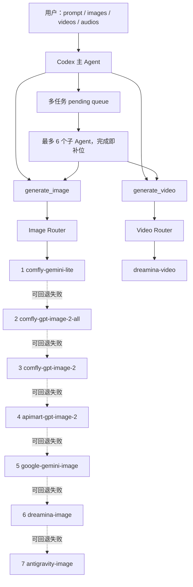

# Codex_image 统一生图与生视频工具重构蓝图

> 用途：将本文件交给一个新的 Codex 窗口执行。新窗口必须先完整读取项目 `AGENTS.md` 和本蓝图，再开始修改。
>
> 本蓝图授权本地源码重构、离线测试、隔离注册测试和文档更新；不授权自动执行新的付费图片或视频生成。任何真实联网且可能扣费的验收测试，仍须在离线测试全部通过后再次获得用户明确确认。

## 1. 最终目标

把 `Codex_image` 从“五个用户可见的独立 provider 技能”重构为一个统一的 Codex 媒体工具。

Codex 中只公开并注册两个默认工具：

1. `generate_image`：默认生图工具。
2. `generate_video`：默认生视频工具。

同时只公开两个对应技能：

1. `$default-image-generation`
2. `$default-video-generation`

底层 provider、模型、API Key、CLI 登录、回退顺序和日志均由项目内部处理，不要求普通用户选择供应商。

### 1.1 公开输入范围

`generate_image` 只接收：

- `prompt`：必需字符串。
- `images`：可选本地图片路径数组。

`generate_video` 只接收：

- `prompt`：必需字符串。
- `images`：可选本地图片路径数组。
- `videos`：可选本地视频路径数组。
- `audios`：可选本地音频路径数组。

不要把 provider、model、API URL、API Key、CLI 子命令、输出目录、日志目录、并发参数、超时参数或代理参数暴露为默认工具的公开输入。

用户在提示词中明确提出比例、分辨率、时长、画质或模型偏好时，路由层可以解析并应用；没有明确要求时使用项目默认值。

### 1.2 图片后端顺序

Comfly 的三个模型视为三个独立的逻辑 API adapter。单个图片任务严格按以下顺序串行尝试：

1. `comfly-gemini-lite` → Comfly `gemini-3.1-flash-lite-image`
2. `comfly-gpt-image-2-all` → Comfly `gpt-image-2-all`
3. `comfly-gpt-image-2` → Comfly `gpt-image-2`
4. `apimart-gpt-image-2` → 现有 `gpt-api`
5. `google-gemini-image` → 现有 `gemini-api`
6. `dreamina-image` → 现有 `seedance-cli` 图片能力
7. `antigravity-image` → 现有 `gemini-cli`

规则：

- 一个任务中的七级回退永远串行，绝不并行、竞速或 hedging。
- 当前 adapter 成功产生可验证的非空本地图片后立即停止。
- 只有明确可回退的失败才进入下一个 adapter。
- Comfly 三个 adapter 共用 `COMFLY_API_KEY`、Base URL、请求构造和下载实现，但具有独立 adapter ID、模型 ID、健康状态、日志、指标、并发槽位和熔断状态。
- 不得再在 `comfly-api` adapter 内部隐藏三模型回退；回退必须上移到统一图片路由器，确保三个 Comfly adapter 可独立观察和控制。

### 1.3 视频后端

视频只允许调用 `seedance-cli`，不得自动切换到其他 provider。

公开音频输入。视频子命令选择规则：

| 输入组合 | Dreamina 子命令 |
| --- | --- |
| 只有 prompt | `text2video` |
| 一张图片，无视频、无音频 | `image2video` |
| 两张图片且用户明确表达“首尾帧” | `frames2video` |
| 多张图片，无视频、无音频，且不是首尾帧语义 | `multiframe2video` |
| 包含任意视频 | `multimodal2video` |
| 包含任意音频，且同时有图片或视频 | `multimodal2video` |
| 只有 prompt + audio，没有图片或视频 | 输入错误，立即拒绝 |

继续遵守当前 Dreamina 限制：

- `multimodal2video` 至少有一张图片或一个视频。
- 当前帮助允许最多 9 张图片、3 个视频、3 个音频。
- 音频长度必须为 2–15 秒。
- 每次真实提交前运行对应子命令 `-h` 并验证本地文件。
- 支持模型的默认视频模型为 `seedance2.5`。
- 支持分辨率参数的默认值为 `720p`。
- `multiframe2video` 不注入其不支持的模型或分辨率参数。

## 2. 并发目标

所有底层 provider/adapter 的默认并发上限统一设置为 `6`。

### 2.1 Provider 默认并发

以下每个 adapter 的 `max_concurrency` 默认值均为 6：

| Adapter ID | 默认并发 |
| --- | ---: |
| `comfly-gemini-lite` | 6 |
| `comfly-gpt-image-2-all` | 6 |
| `comfly-gpt-image-2` | 6 |
| `apimart-gpt-image-2` | 6 |
| `google-gemini-image` | 6 |
| `dreamina-image` | 6 |
| `antigravity-image` | 6 |
| `dreamina-video` | 6 |

`dreamina-image` 与 `dreamina-video` 使用同一个本地账号和 CLI。实现时使用共享容量键 `seedance-cli`，两类任务合计最多 6 个并发，不允许图片 6 个加视频 6 个形成 12 个 Dreamina 并发。

Comfly 三个 adapter 按用户要求视为三个独立逻辑 API，因此分别拥有并发上限 6。统一批任务的全局并发仍为 6，所以单批任务不会产生 18 个 Comfly 并发请求。

### 2.2 子 Agent 默认并发

- 多任务时，当前 Codex 根任务本身就是主 Agent，不再额外创建一个“主 Agent”。
- 主 Agent 最多同时维持 6 个子 Agent。
- 任意子 Agent 完成后，立即从 pending 队列补充下一个任务，直到队列为空。
- 子 Agent 一次只处理一个媒体任务。
- 子 Agent 禁止继续创建孙 Agent。
- 单任务时由主 Agent 直接执行，不创建子 Agent。
- Codex 运行时可能提供少于 6 个可用子 Agent 槽位。有效值必须是：

```text
effective_child_concurrency = min(6, runtime_available_child_slots)
```

配置目标始终为 6，但不得声称突破产品运行时的实际并发限制。

### 2.3 跨进程并发保护

因为多个子 Agent 会启动独立进程，不能只用单进程内的 `threading.Semaphore`。

实现项目私有的跨进程 slot lease：

```text
.codex-image-private/locks/providers/<capacity-key>/
├── slot-1.lock
├── slot-2.lock
...
└── slot-6.lock
```

要求：

- 用原子排他创建获取槽位，例如 Python `os.open(..., O_CREAT | O_EXCL)`。
- lock 内容只记录非敏感的 PID、task ID、创建时间和 heartbeat 时间。
- 正常完成、失败或取消都在 `finally` 中释放。
- 支持清理超过配置阈值且对应 PID 已不存在的 stale lock。
- 不得删除不属于当前项目私有锁目录的文件。
- slot 等待必须有超时和可取消行为。
- 默认每个 capacity key 有 6 个槽位。

## 3. 推荐最终架构



### 3.1 四层职责

1. **Codex 注册层**：只公开两个技能和两个 MCP 工具。
2. **路由层**：验证输入、选择图片回退顺序或视频子命令、归一化错误和结果。
3. **Adapter 层**：封装单个 provider/model 的一次调用，不做跨 adapter 回退。
4. **运行层**：私有任务目录、并发 lease、日志、状态恢复、输出验证和指标。

## 4. 最终注册形态

最终目标使用一个本地 Plugin，包含两个技能和一个本地 MCP server。

```text
codex-media-plugin/
├── .codex-plugin/
│   └── plugin.json
├── skills/
│   ├── default-image-generation/
│   │   ├── SKILL.md
│   │   └── agents/openai.yaml
│   └── default-video-generation/
│       ├── SKILL.md
│       └── agents/openai.yaml
└── mcp/
    ├── server.py
    └── schemas.py
```

实施新 Plugin 时必须先读取并遵守 `$plugin-creator` 和 `$skill-creator`。

### 4.1 MCP 公开工具

MCP server 只暴露两个工具，不暴露 provider 调试工具：

#### `generate_image`

输入 schema：

```json
{
  "type": "object",
  "properties": {
    "prompt": { "type": "string", "minLength": 1 },
    "images": {
      "type": "array",
      "items": { "type": "string" },
      "default": []
    }
  },
  "required": ["prompt"],
  "additionalProperties": false
}
```

#### `generate_video`

输入 schema：

```json
{
  "type": "object",
  "properties": {
    "prompt": { "type": "string", "minLength": 1 },
    "images": { "type": "array", "items": { "type": "string" }, "default": [] },
    "videos": { "type": "array", "items": { "type": "string" }, "default": [] },
    "audios": { "type": "array", "items": { "type": "string" }, "default": [] }
  },
  "required": ["prompt"],
  "additionalProperties": false
}
```

两个工具均为外部付费操作，MCP annotations 应包含 `openWorldHint: true`，不要标为只读。工具描述必须说明可能消耗 provider 额度。

### 4.2 技能触发

`default-image-generation` 的描述覆盖：

- 生成图片、画图、文生图。
- 根据一张或多张图片编辑、合成、改图。
- 默认图片工具，不要求用户指定 provider。

`default-video-generation` 的描述覆盖：

- 文生视频。
- 图片生视频。
- 多图、首尾帧、参考视频或参考音频生成视频。
- 默认视频工具，只使用 Seedance/Dreamina。

两个技能允许隐式调用：

```yaml
policy:
  allow_implicit_invocation: true
```

现有 provider 技能保留为源码维护文档，但：

- 不再默认全局注册。
- `agents/openai.yaml` 设置 `allow_implicit_invocation: false`。
- 只能用于显式诊断或 adapter 开发。
- 普通媒体请求不得直接触发 provider 技能。

### 4.3 图片超时边界

- 单个图片 adapter 从等待并发槽位到返回有效本地图片，最多允许 120 秒。
- 超过 120 秒后必须终止该 adapter 的活动进程或请求，记录 `provider_timeout`，再按既定顺序进入下一个 adapter；不得并行竞速。
- 单个图片任务从路由开始计算，整体最多允许 300 秒；单 adapter 的实际预算为 `min(120 秒, 图片任务剩余时间)`。
- 达到 300 秒后必须停止路由，持久化 `task_timeout` 和终态 `failed`。执行该任务的子 Agent 立即返回失败并退出任务队列，使主 Agent 可以补入下一个待处理任务。
- 超时参数属于路由器内部配置，不加入 `generate_image` 的公开 MCP schema，也不要求普通用户输入。

## 5. 推荐目标目录

在保留现有 provider 包装器兼容性的前提下新增统一层：

```text
Codex_image/
├── AGENTS.md
├── config/
│   └── media-router.defaults.json
├── CLI/
│   ├── Media-Router/
│   │   ├── run.ps1
│   │   ├── media_router.py
│   │   └── media_router/
│   │       ├── __init__.py
│   │       ├── config.py
│   │       ├── schemas.py
│   │       ├── errors.py
│   │       ├── safe_logging.py
│   │       ├── output_validation.py
│   │       ├── concurrency.py
│   │       ├── image_router.py
│   │       ├── video_router.py
│   │       ├── task_store.py
│   │       ├── scheduler.py
│   │       └── providers/
│   │           ├── base.py
│   │           ├── registry.py
│   │           ├── comfly_common.py
│   │           ├── comfly_gemini_lite.py
│   │           ├── comfly_gpt_image_2_all.py
│   │           ├── comfly_gpt_image_2.py
│   │           ├── apimart_gpt_image_2.py
│   │           ├── google_gemini_image.py
│   │           ├── dreamina_image.py
│   │           ├── antigravity_image.py
│   │           └── dreamina_video.py
│   ├── media-router.cmd
│   └── <现有 provider CLI 兼容入口>
├── codex-media-plugin/
│   ├── .codex-plugin/plugin.json
│   ├── skills/
│   │   ├── default-image-generation/
│   │   └── default-video-generation/
│   └── mcp/
├── tests/
│   ├── unit/
│   ├── integration/
│   └── fixtures/
└── .codex-image-private/
    ├── .env
    ├── jobs/
    ├── outputs/
    ├── logs/
    ├── locks/
    ├── cache/
    └── validation/
```

不要在公开源码树生成或保留 `__pycache__`、`.pyc`、测试输出、日志或媒体文件。所有 Python 入口设置 `PYTHONDONTWRITEBYTECODE=1`。

## 6. 默认配置

新增受版本控制的 `config/media-router.defaults.json`：

```json
{
  "schema_version": 1,
  "scheduler": {
    "max_child_agents": 6,
    "refill_on_completion": true
  },
  "providers": {
    "comfly-gemini-lite": { "enabled": true, "priority": 1, "max_concurrency": 6 },
    "comfly-gpt-image-2-all": { "enabled": true, "priority": 2, "max_concurrency": 6 },
    "comfly-gpt-image-2": { "enabled": true, "priority": 3, "max_concurrency": 6 },
    "apimart-gpt-image-2": { "enabled": true, "priority": 4, "max_concurrency": 6 },
    "google-gemini-image": { "enabled": true, "priority": 5, "max_concurrency": 6 },
    "dreamina-image": { "enabled": true, "priority": 6, "max_concurrency": 6, "capacity_key": "seedance-cli" },
    "antigravity-image": { "enabled": true, "priority": 7, "max_concurrency": 6 },
    "dreamina-video": { "enabled": true, "max_concurrency": 6, "capacity_key": "seedance-cli" }
  }
}
```

允许私有覆盖文件：

```text
.codex-image-private/config/media-router.json
```

合并规则：

1. 读取版本控制默认值。
2. 读取私有覆盖。
3. 校验所有并发值是 1–6 的整数。
4. 未指定时一律为 6。
5. 普通工具调用不允许通过 prompt 提高并发上限。

## 7. Adapter 合同

每个 adapter 实现同一接口，且一次调用只处理一个任务和一个 provider/model。

建议 Python `Protocol`：

```python
class MediaProvider(Protocol):
    provider_id: str
    capability: Literal["image", "video"]
    capacity_key: str
    max_concurrency: int

    def check_readiness(self) -> Readiness: ...
    def execute(self, request: MediaRequest, context: TaskContext) -> ProviderResult: ...
```

`ProviderResult` 至少包含：

```json
{
  "provider_id": "comfly-gemini-lite",
  "model_id": "gemini-3.1-flash-lite-image",
  "status": "success",
  "failure_class": null,
  "request_id": null,
  "submit_id": null,
  "output_path": "...",
  "output_bytes": 0,
  "started_at": "...",
  "finished_at": "...",
  "duration_ms": 0
}
```

Adapter 禁止：

- 调用另一个 adapter。
- 自动跨 provider 回退。
- 在结果或日志中返回 API Key、Authorization、Cookie、Base64、完整原图内容或未过滤的 provider 错误正文。
- 视觉读取本地原图。

## 8. Comfly 拆分要求

重构当前 `CLI/Comfly-API/comfly_api.py`：

1. 抽出 `comfly_common.py`，只包含：
   - `.env` 和代理读取。
   - UTF-8 JSON 构造。
   - multipart 构造。
   - API 请求。
   - `data[0].url` 提取。
   - 带 UA/Accept/Referer 的下载。
   - 输出验证。
   - 安全错误归一化。
2. 单个 Comfly adapter 必须接收固定 model ID，只提交一次。
3. 删除 adapter 内部的 `MODEL_PRIORITY` 自动循环。
4. `ImageRouter` 通过 provider registry 按优先级调用三个独立 adapter。
5. 保留 `CLI/comfly-api.cmd` 作为显式调试入口时，要求传 `--model`，或者提供三个清晰子命令；不得重新引入隐藏回退。
6. 三个 adapter 都读取同一个 `COMFLY_API_KEY`。
7. 三个 adapter 的日志和健康状态目录分开。

## 9. 错误分类与回退

统一错误类型：

| failure_class | 是否进入下一图片 adapter | 说明 |
| --- | --- | --- |
| `input_error` | 否 | 缺文件、非法组合、不支持格式、空 prompt |
| `auth_unavailable` | 是 | Key 缺失、CLI 未登录；跳过当前 adapter |
| `quota_unavailable` | 是 | 额度不足或账号能力不可用 |
| `definite_provider_failure` | 是 | 明确 HTTP 错误、provider 返回失败、缺 URL |
| `download_failure` | 是 | 下载失败、WAF、非图片响应、空输出 |
| `timeout_before_submit` | 是 | 能确定尚未提交付费任务 |
| `indeterminate_submission` | 否 | 请求可能已提交或扣费，但客户端未拿到结果 |
| `policy_rejection` | 否 | 不允许通过换 provider 绕过安全/合规拒绝 |
| `cancelled` | 否 | 用户或主 Agent 取消 |

`indeterminate_submission` 必须标记 `needs_review`。不要自动重试同一 adapter，也不要自动继续下一个 provider，以避免重复扣费。

## 10. 输出验证

图片成功必须同时满足：

- 本地文件存在。
- 文件大小大于 0。
- Content-Type 或文件签名为受支持图片。
- 输出先写入同目录临时文件，再原子替换最终文件。
- 全部失败时保留已有目标文件。

视频成功必须同时满足：

- 获得有效 `submit_id` 或明确同步成功结果。
- 任务达到 provider 成功终态。
- 下载后的本地文件存在且非空。
- 可选用 `ffprobe` 做容器和时长验证，但输出不得写入公开源码树。

视觉检查本地图片时，始终先运行 512 px 预览转换器，只查看预览。视频需要抽帧检查时，抽帧和预览也必须写入 `.codex-image-private/validation/`。

## 11. 任务存储与恢复

每次调用创建稳定任务目录：

```text
.codex-image-private/jobs/<batch-id>/<task-id>/
├── request.json
├── state.json
├── result.json
├── outputs/
└── logs/
```

`request.json` 不保存 Base64 或媒体内容，只保存本地绝对路径和脱敏 prompt 元数据。完整 prompt 如业务上必须落盘，只能保存在私有任务目录，且不得复制到普通 provider 日志；优先只在进程内传递。

状态机：

```text
pending -> running -> success
                   -> failed
                   -> needs_review
                   -> cancelled
```

进程重启后：

- `success` 不重复执行。
- `failed` 只在用户明确要求时重试。
- `needs_review` 不自动重试。
- 旧 `running` 根据是否存在有效 provider task ID 和 lock heartbeat 决定恢复查询或转为 `needs_review`。

## 12. 多任务主 Agent 调度协议

统一技能必须告诉 Codex：当识别到两个或以上相互独立的媒体任务时启用子 Agent。

主 Agent 流程：

```text
parse user request
  -> create batch manifest
  -> pending queue
  -> fill available child slots up to 6
  -> wait for any child completion
  -> validate/read child result.json
  -> immediately refill freed slots
  -> repeat until pending and running are empty
  -> summarize all results
```

伪代码：

```python
MAX_CHILDREN = 6
pending = deque(tasks)
active = {}
results = []

while pending or active:
    available = min(MAX_CHILDREN, runtime_available_child_slots())
    while pending and len(active) < available:
        task = pending.popleft()
        child = spawn_child(task_id=task.id, manifest_path=task.path)
        active[child.id] = task

    updates = wait_for_any(active)
    for child in terminal_children(updates):
        results.append(load_and_validate_result(active[child.id]))
        del active[child.id]
        # 下一轮 while 立即补位

return aggregate(results)
```

给子 Agent 的任务必须是有边界的单任务，例如：

```text
处理 manifest 中 task-007。只处理该任务，不创建子 Agent。调用默认媒体路由器，等待终态，将结构化结果写入指定 result.json，并返回 provider、model、状态和输出路径的简短摘要。不要回传完整日志或任何凭据。
```

主 Agent 汇总至少包含：

- task ID。
- 成功、失败、需复核或取消。
- 最终输出路径。
- 实际 provider 和 model。
- 尝试过的 adapter 列表。
- `needs_review` 的明确原因。
- 不输出密钥或完整内部日志。

## 13. 状态与注册脚本重构

当前状态脚本把“provider skill 已全局注册”当成 provider readiness 的一部分。重构后必须解耦。

### 13.1 新状态模型

`get-pipeline-setup-status.ps1` 改为返回：

```json
{
  "tools": {
    "default-image-generation": {
      "registered": true,
      "status": "ready"
    },
    "default-video-generation": {
      "registered": true,
      "status": "ready"
    }
  },
  "providers": {
    "comfly-gemini-lite": { "ready": true, "max_concurrency": 6 },
    "comfly-gpt-image-2-all": { "ready": true, "max_concurrency": 6 },
    "comfly-gpt-image-2": { "ready": true, "max_concurrency": 6 },
    "apimart-gpt-image-2": { "ready": true, "max_concurrency": 6 },
    "google-gemini-image": { "ready": true, "max_concurrency": 6 },
    "dreamina-image": { "ready": true, "max_concurrency": 6 },
    "antigravity-image": { "ready": true, "max_concurrency": 6 },
    "dreamina-video": { "ready": true, "max_concurrency": 6 }
  }
}
```

工具状态：

- `ready`：工具注册，且所有预期 adapter 就绪。
- `degraded`：工具注册，至少一个 adapter 可用，但部分 adapter 不可用。
- `unavailable`：没有任何可用后端，或工具未注册。

默认图片工具允许 degraded 工作，并在日志/状态中明确跳过原因。默认视频工具只有一个 provider，Dreamina 不可用时即 unavailable。

### 13.2 注册迁移

重构 `register-global-skills.ps1` 或新增 `register-default-media-tools.ps1`：

- 默认只注册两个统一技能和 Plugin/MCP。
- 不再把五个 provider 技能注册为普通用户可见技能。
- 提供显式开发者开关注册 provider 技能，例如 `-ProviderSkills`，默认关闭。
- 迁移时只删除带 `.codex-image-registration.json` marker 且 `source_root` 匹配当前项目的旧全局 provider 技能。
- 不得删除用户自行安装、没有 marker 或来自其他 source root 的同名技能。
- 先完成新工具注册和隔离验证，再移除旧 provider 全局技能，避免不可用窗口。

### 13.3 状态文件迁移

将 `codex-image-registration-state.json` 升级到 schema v2：

```json
{
  "schema_version": 2,
  "source_root": "...",
  "registered_tools": [
    "default-image-generation",
    "default-video-generation"
  ],
  "setup_completed_tools": [],
  "provider_readiness": {},
  "updated_at": "..."
}
```

迁移必须：

- 原子写入。
- 写入前在 `.codex-image-private/validation/state-migration/` 保存脱敏备份。
- 保留旧字段读取兼容，至少一个版本周期。
- 不把 Key 值写入状态。

## 14. 安全日志统一

现有 wrapper 日志策略不完全一致。统一路由后必须统一为：

- prompt 日志只记录 `<redacted>`、字符数和 SHA-256。
- 不记录 API Key、Bearer、Cookie、登录材料。
- 不记录原图、视频、音频内容或 Base64。
- 不记录包含本地媒体内容的 multipart body。
- provider 错误正文必须经过白名单提取或安全归一化。
- 可以记录：adapter、model、endpoint、状态码、request ID、task/submit ID、远程媒体 URL、文件数量、输出路径、输出字节数、耗时、失败分类。
- Antigravity transcript 和 Dreamina 输出需要过滤潜在凭据后再保存。
- 所有日志只写 `.codex-image-private/logs/` 或具体 job 目录。

## 15. 实施阶段

### 阶段 0：基线与保护

1. 读取 `AGENTS.md`、本蓝图和所有现有 provider wrapper。
2. 运行：

```powershell
powershell -NoProfile -ExecutionPolicy Bypass -File .\get-pipeline-setup-status.ps1 -CheckLogin
```

3. 只检查 `.env` 变量名，不显示值。
4. 记录当前真实全局注册状态。
5. 当前项目不是 Git 工作树，不要依赖 `git status` 或 `git diff`。
6. 现有核心备份位于用户指定的外部备份目录（如果存在）：

```text
`<external-backup-root>\Codex_image-core-backup`
```

7. 不修改或删除该外部备份。
8. 发现工作期间出现无法解释的外部文件变更时停止并询问用户。

### 阶段 1：配置、schema 和错误类型

1. 创建默认配置。
2. 创建请求、任务、provider result 和最终 result schema。
3. 创建失败分类。
4. 创建安全日志工具。
5. 创建输出验证工具。
6. 完成纯单元测试。

### 阶段 2：Provider adapter 化

1. 先拆 Comfly common 和三个独立 adapter。
2. 将 APIMart、Google Gemini、Dreamina 图片、Antigravity 包装为单调用 adapter。
3. 将 Dreamina 视频包装为单 provider adapter。
4. 现有 CLI 入口保持兼容，但改为调用 adapter。
5. 禁止 adapter 之间互相导入或回退。

### 阶段 3：路由器

1. 实现七级图片串行路由。
2. 实现视频输入到 Dreamina 子命令的映射。
3. 实现 readiness skip、错误分类和成功即停。
4. 实现任务目录和原子结果。
5. 实现跨进程 slot lease，默认全部为 6。

### 阶段 4：批任务与子 Agent 协议

1. 实现 batch manifest parser 和任务状态。
2. 在技能/AGENTS 中写明主 Agent 的滚动 6 槽调度协议。
3. 用 fake child runner 验证完成即补位。
4. 不在 Python 路由器中假装创建 Codex 子 Agent；实际 Agent 生成由 Codex 主 Agent 按技能指令执行。

### 阶段 5：Plugin/MCP 与两个默认技能

1. 读取 `$plugin-creator` 和 `$skill-creator`。
2. 创建 Plugin manifest。
3. 创建只含两个工具的本地 MCP server。
4. 创建两个统一技能。
5. provider 技能关闭隐式调用。
6. 在隔离 `CodexHome` 中注册并确认工具清单严格只有 `generate_image` 和 `generate_video`。

### 阶段 6：状态、注册和文档迁移

1. 更新状态脚本。
2. 更新注册与完成脚本。
3. 原子迁移真实状态。
4. 新工具验证后，安全移除项目托管的旧 provider 全局技能。
5. 将 `AGENTS.md` 从“五条独立管线由用户选择”改为“两个统一默认工具 + 内部 adapter 路由”。
6. 更新 Mermaid 图、首次配置说明、并发规则、音频入口和付费确认规则。

### 阶段 7：离线验证

全部通过后才能申请联网测试。

### 阶段 8：小规模联网验收

必须再次向用户列出预计请求数量和可能费用并获得确认。

## 16. 必须实现的离线测试

### 16.1 图片路由

- 三个 Comfly model 是三个独立 adapter。
- 默认顺序严格为 1–7。
- 当前 adapter 成功后不调用后续 adapter。
- 明确失败进入下一 adapter。
- input error 不回退。
- policy rejection 不回退。
- indeterminate submission 不回退并标记 needs_review。
- 全部失败时结果包含七次脱敏尝试记录。
- 全部失败不覆盖已有输出。
- 单 adapter 超过注入的短测试预算后记录 `provider_timeout`，终止其活动进程并串行进入下一 adapter。
- adapter 在截止时间前返回有效图片时不调用后续 adapter。
- 图片任务达到注入的短测试总预算后记录 `task_timeout`、持久化失败结果且不再调用 adapter。
- adapter 预算被图片任务剩余总预算正确截断。

### 16.2 视频路由

- prompt-only → `text2video`。
- 单图 → `image2video`。
- 明确首尾帧 → `frames2video`。
- 多图普通叙事 → `multiframe2video`。
- 任意 video → `multimodal2video`。
- image + audio → `multimodal2video`。
- video + audio → `multimodal2video`。
- audio-only → input error。
- 文件数量和音频时长校验。
- `multiframe2video` 不注入不支持的 model/resolution。

### 16.3 并发

- 每个 adapter 默认并发配置为 6。
- `seedance-cli` 图片和视频共享总计 6 个槽位。
- 同一 adapter 第 7 个请求必须等待。
- 释放一个槽位后，第 7 个立即获得槽位。
- stale lock 可安全回收。
- 单个任务内部从不并行尝试 provider。
- 模拟 8 个独立任务：前 6 个启动；任意一个完成后第 7 个立即启动；再完成一个后第 8 个立即启动。
- 模拟运行时只有 3 个子 Agent 槽位时，保持 3 个滚动并发而不是失败。
- 图片子任务因 `task_timeout` 返回后立即释放并补充队列槽位。

### 16.4 安全与私有边界

- 日志不含 Key、Authorization、Cookie、原始媒体内容、Base64 或完整 prompt。
- dry-run 不读取图片、视频或音频内容。
- 所有输出、日志、锁、缓存和验证产物都在 `.codex-image-private`。
- 公开源码树没有 `__pycache__` 或 `.pyc`。
- 本地图片视觉检查只查看 512 px 预览。

### 16.5 注册

- 隔离 CodexHome 中只有两个默认技能。
- MCP tool list 只有 `generate_image` 和 `generate_video`。
- provider skills 不允许隐式触发。
- 状态能区分 ready、degraded、unavailable。
- 旧状态能迁移到 schema v2。
- 不删除非本项目托管的全局技能。

## 17. 联网验收建议

离线验证完成后，先向用户报告：

- 将调用哪些 provider。
- 每项测试最多产生多少付费请求。
- 是否包含视频任务。
- 是否包含故障/回退测试。
- 是否包含 8 任务并发测试。

建议分开确认：

1. 一次默认文生图。
2. 一次单参考图编辑。
3. 一次 prompt-only 视频。
4. 一次 image + audio 视频。
5. 一次 image + video + audio 视频。
6. 八任务滚动六并发验收。

不要为了验证回退而真实故意消耗七个 provider。回退顺序主要通过离线 fake adapters 验证；真实 provider 故障只在自然发生时记录。

## 18. 验收标准

重构完成必须同时满足：

- Codex 普通用户只看到两个默认工具和两个默认技能。
- 图片任务按七个 adapter 严格串行回退。
- Comfly 三模型可独立统计、熔断、限流和测试。
- 视频只使用 Seedance CLI，并公开 image/video/audio 输入。
- 所有 adapter 默认并发为 6。
- 多任务最多 6 个子 Agent，完成即补位；运行时槽位更少时自动降到可用值。
- 单任务不创建子 Agent。
- 任务可恢复，indeterminate 不自动重复扣费。
- 所有敏感数据和运行产物保持在 `.codex-image-private`。
- 512 px 图片预览限制保持有效。
- 旧 provider CLI 仍可显式诊断。
- 旧 provider 技能不再默认注册或隐式调用。
- 离线测试、隔离注册、技能校验、Plugin 校验和 share-ready 检查全部通过。
- 未经新确认不执行任何额外付费测试。

## 19. 明确禁止事项

- 不得把七个 provider 同时并行请求并选择最快结果。
- 不得把 provider/model 作为默认公开工具参数。
- 不得让子 Agent 创建子 Agent。
- 不得在聊天、命令行参数、源码、日志或注册 metadata 中放置 API Key。
- 不得将媒体 Base64 或原始媒体内容写入日志。
- 不得用换 provider 的方式规避 policy rejection。
- 不得对 indeterminate submission 自动重试或继续下一个付费 provider。
- 不得直接查看本地原始大图。
- 不得覆盖用户已有输出，除非使用成功验证后的原子替换。
- 不得删除没有本项目 marker 的全局技能。
- 不得修改或删除用户指定的外部备份目录。

## 20. 新 Codex 窗口的执行提示

可以把以下内容连同本文件路径发给新的 Codex 窗口：

```text
请完整读取：
1. 当前 checkout 中的 `AGENTS.md`
2. 当前 checkout 中的 `UNIFIED_MEDIA_TOOL_REFACTOR_BLUEPRINT.md`

严格按蓝图分阶段实施 Codex_image 统一媒体工具重构。先建立基线和离线测试，不执行任何新的付费联网生成。所有 provider 默认并发设为 6；多任务最多维持 6 个子 Agent 并滚动补位，但单个图片任务中的七级 provider 回退必须严格串行。Comfly 三模型必须拆成三个独立 adapter。视频只使用 Seedance CLI，并公开 prompt、images、videos、audios。最终只注册 generate_image 和 generate_video 两个工具，以及两个对应默认技能。每完成一个阶段就更新计划并运行该阶段测试；离线验收全部通过后停止，汇报改动和预计联网测试费用，等待确认。
```